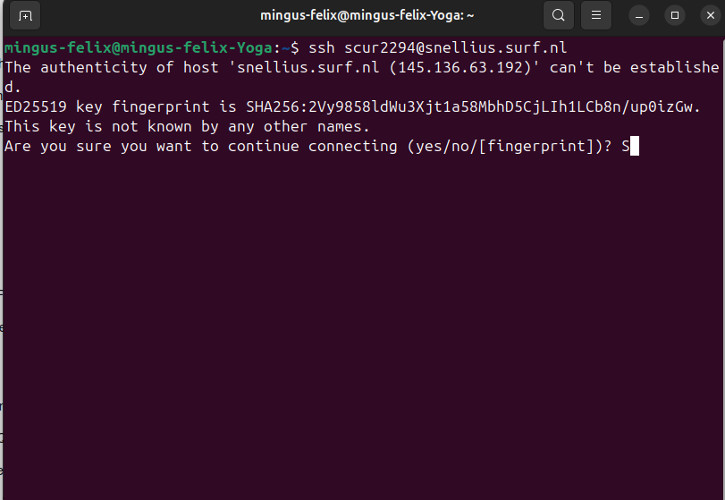
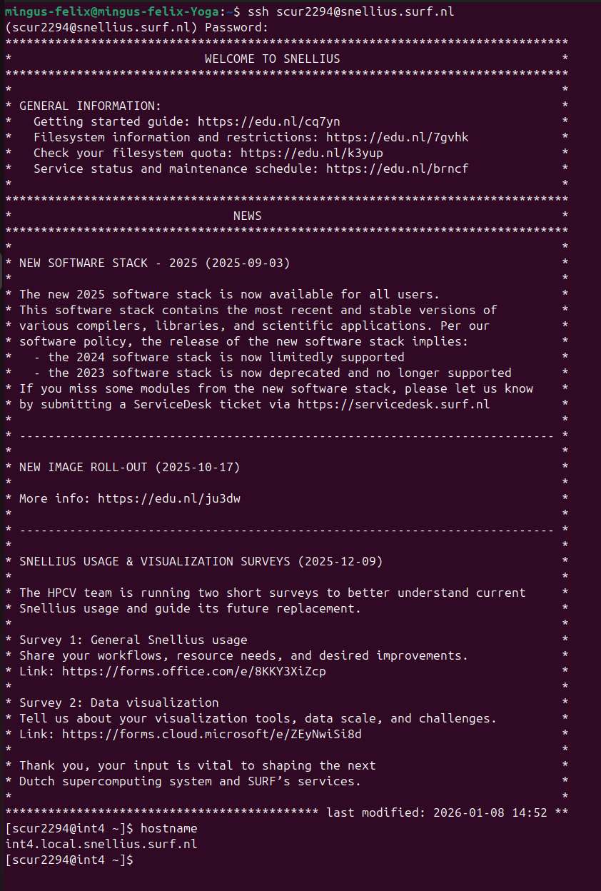

# Assignment 1: Setup & Debugging Journal
**MLOps & ML Programming (2026)**

## Student Information
* **Name:** Mingus Gaston
* **Student ID:** 15113019
* **TA Name:** [Your TA's Name]
* **GitHub Repository:** [Link to your repository]
* **Base Skeleton Used:** [https://github.com/SURF-ML/MLOps_2026/tree/main](https://github.com/SURF-ML/MLOps_2026/tree/main)
---


## Question 1: First Contact with Snellius
1. **Connection Details:**
- **Command:** ssh scur2294@snellius.surf.nl
- **Login Node:** int4
- **Screenshot:** Screenshots of my first contact with the server and the welcome message

    

    


2. **Issues Encountered:**
   - **Error Message1:** `- **Error / Prompt Observed:**

- The authenticity of host 'snellius.surf.nl (145.136.63.192)' can't be established.
ED25519 key fingerprint is SHA256:...
Are you sure you want to continue connecting (yes/no/[fingerprint])?

I didn't really check my mail the last couple weeks, and missed a mail in where i had to choose a password.
Therefore i couldn't continue and had to request a new password.

- After I got my password, I tried to type it in the terminal, but it didn't show any typing so I thought I broke it.

   - **Resolution:** - **Resolution:**

- I asked SURF for a new password which they sent me a few minutes later!

- I called a friend and he said it didn't show the password for privacy reasons and that it was completely normal.


3. **Smooth Connection (If applicable):**

   - **SSH Client:** I used the default Linux client.
   - **Prior Experience:**  We had to use SSH keys in webtech.
   - **Preemptive Steps:** I didn't really take preemptive steps, i kind of went blindly into it all.


## Question 2: Environment Setup
1. **Setup Sequence:**
   - **Commands:**
   ```bash 
     module avail | head
     module avail | 2025
     module avail | grep 2025
     module load 2025
     module spider Python | head -n 20
     python --version
     module load Python/3.11.3-GCCcore-12.3.0
     python --version
     which python
     module list
     module load Python/3.11.3-GCCcore-12.3.0
     module spider Python/3.11.3-GCCcore-12.3.0
     module load 2023
     module load Python/3.11.3-GCCPRE-23.3.0
     module load Python/3.11.3-GCCcore-12.3.0
     module list
     python--version
     python --version
     which python
     module purge
     model load 2023
     module load 2023
     module load Python/3.11.3-GCCcore-12.3.0
     python --version
     mkdir -p ~/venvs
     python -m venv ~/venvs/mlops-a1
     source ~/venevs/mlops-a1/bin/activate
     ls ~/venvs
     rm -rf ~/venvs/mlops-a1
     python -m venv ~/venvs/mlops-a1
     ls ~/venvs
     source ~/venvs/mlops-a1/bin/activate
     which python
     python --version
     realpath ~/venvs/mlops-a1
     ```


   - **Full Venv Path:** `/gpfs/home4/scur2294/venvs/mlops-a1`

2. **Pip Install Torch:**
   - **Duration:** Around 10 minutes
   - **Warnings:** No big errors, any CUDA related errors are normal if you dont have access to a GPU.
   - **Venv Size:** 
   ```bash
        du -sh ~/venvs/mlops-a1
        6.9G    /home/scur2294/venvs/mlops-a1

3. **Mistakes/Unexpected Behavior:**
 - I initially tried the filter "module avail | 2025" and forgot to add grep, this gave me an error.

 - I couldn't load Python 3.11.3 in the 2025 stack, since it only worked in the 2023.

 - I made a typo when i tried to check the python version i typed "python--version" 

 - After making the environment,  it couldn't find the activation script. This meant that it had not been created correctly. So I deleted it and did it again.

 - When checking what the size of my Venv was, I initially only did "du -sh" this gave me a way bigger number.

4. **Verification:**
   - **Output:** 

```bash
which python
/home/scur2294/venvs/mlops-a1/bin/python

python --version
Python 3.11.3
``` 

   - **Explanation:** [Why is CUDA False on a login node?]

   Cuda is reported as False, because the login nodes in Snellius have no access to GPU.


   ## Question 3: Version Control Setup
1. **GitHub URL:** [Link]
2. **Authentication:** [HTTPS/SSH/CLI] + [Errors encountered]
3. **.gitignore:**
   - **Contents:** [Paste code block]
   - **Important items to include:** [Reasoning]
   - **README info:** [Should Snellius access info be in README?]
4. **Git Log:** `[Paste output of git log --oneline]`
